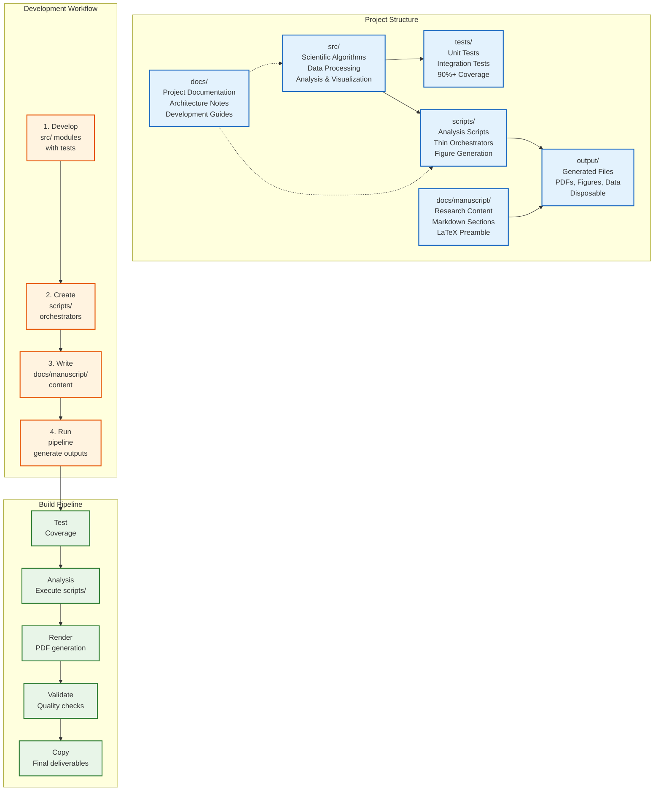

# Ento-Linguistic Research Project, self-contained research project examining how language shapes scientific understanding in entomology through systematic analysis of terminology networks across six Ento-Linguistic domains

## Research Overview

This project investigates the entanglement of speech and thought in entomological research by analyzing how scientific terminology creates conceptual frameworks, framing assumptions, and communication patterns that influence research practice.

**Six Core Domains:**

1. **Unit of Individuality** - Ant vs. colony vs. superorganism
2. **Behavior and Identity** - Foraging behavior vs. forager identity
3. **Power & Labor** - Caste, queen, worker terminology structures
4. **Sex & Reproduction** - Gender concepts in ant reproduction
5. **Kin & Relatedness** - Kinship terminology in social insects
6. **Economics** - Market logic in colony resource allocation

## Project Structure

```text
./
├── src/                    # Ento-Linguistic analysis algorithms
├── tests/                  # Test suite (1198 tests, 90%+ coverage)
├── scripts/                # Analysis pipelines and workflows
├── docs/manuscript/             # Research manuscript on language in entomology
├── docs/                   # Analysis documentation and guidelines
└── output/                 # Generated analyses, figures, and reports
```

## Quick Start

### Install Dependencies

```bash
uv sync
```

### Run Tests

```bash
uv run pytest tests/ --cov=src --cov-report=term-missing
```

This project is located under `projects/ento_linguistics/` and is automatically discovered by the root pipeline. Run with `./run.sh --project ento_linguistics` or select from the interactive menu.

### Run Analysis

```bash
uv run python scripts/01_build_corpus.py
uv run python scripts/02_generate_figures.py
```

### Build Manuscript (from template root)

```bash
uv run python scripts/03_render_pdf.py --project ento_linguistics
```

## Current Status

Run the following to measure:

```bash
uv run python scripts/01_run_tests.py --project ento_linguistics
uv run pytest tests/ --cov=src --cov-report=term-missing
```

Outputs in `output/reports/test_results.json` and `output/figures/figure_registry.json` provide current test counts, coverage, and figure details. Scripts in `scripts/` import from `src/` (thin orchestrators). See `src/AGENTS.md` for module details.

## Extension

- Add logic in `src/`.
- Import from `src/` in `scripts/`.
- Add corresponding tests.
- Update `docs/manuscript/` sections and `config.yaml`.
- Run `uv run python scripts/02_generate_figures.py` then validation.

## Scientific Contributions

**Ento-Linguistic Analysis Framework:**

- **Six-domain taxonomy** for analyzing terminology in entomological research
- **Mixed-methodology approach** combining computational text analysis with theoretical discourse examination
- **Terminology network analysis** revealing structural patterns in scientific language
- **Domain-specific insights** into how language shapes scientific understanding

**Key Domains Analyzed:**

1. **Unit of Individuality** - Biological vs. social individuality concepts
2. **Behavior and Identity** - How behavioral descriptions create categorical identities
3. **Power & Labor** - Hierarchical terminology in social insect research
4. **Sex & Reproduction** - Gender concepts applied to insect reproductive biology
5. **Kin & Relatedness** - Kinship terminology in social insect societies
6. **Economics** - Market logic in colony resource allocation

## Reproducibility & Data Availability

**Reproducible Analysis:**

- All computational methods include seeded randomness for deterministic results
- codebase with test suite (1198 tests)
- Detailed documentation of algorithms and methodological choices
- Version-controlled environment specifications

**Data Sources:**

- PubMed API integration for real-time literature access
- arXiv API for preprint literature
- Cached search results to minimize redundant API calls
- Structured corpus management with serialization support

**Code Availability:**

- Python implementation with type hints
- Modular architecture supporting extension and reuse
- error handling and input validation
- Cross-platform compatibility (macOS, Linux, Windows)

## Features

- Test suite with real data and HTTP testing (pytest-httpserver for literature mining).
- Modules in `src/analysis/`, `src/core/`, `src/data/`, `src/pipeline/`, `src/visualization/` with corresponding tests.
- Deterministic outputs (fixed seeds, e.g. `random_state=42` in KMeans and generators).
- Input validation and error handling returning `ValidationResult` objects.
- Reproducible corpus loading from `data/corpus/abstracts.json` and synthetic data via `DataGenerator`.
- Figures registered in `output/figures/figure_registry.json`.

## Project Architecture



## Quick Usage Examples

### Basic Term Extraction

```python
from src.term_extraction import TerminologyExtractor

# Extract terms from entomological texts
extractor = TerminologyExtractor()
texts = [
    "Ant colonies exhibit complex social behavior with division of labor.",
    "The queen ant lays eggs while worker ants forage for food.",
    "Eusocial insects demonstrate sophisticated communication patterns."
]

terms = extractor.extract_terms(texts, min_frequency=2)
for term_name, term_obj in terms.items():
    print(f"Term: {term_name}, Frequency: {term_obj.frequency}, Domains: {term_obj.domains}")
```

### Literature Mining

```python
from src.literature_mining import PubMedMiner, LiteratureCorpus

# Search PubMed for entomological research
miner = PubMedMiner()
pmids = miner.search("ant colony behavior", max_results=50)

# Fetch publication details
publications = miner.fetch_publications(pmids[:5])  # Get first 5
corpus = LiteratureCorpus(publications)

# Analyze the corpus
stats = corpus.get_statistics()
print(f"Corpus contains {stats['total_publications']} publications")
```

### Domain Analysis

```python
from src.domain_analysis import DomainAnalyzer
from src.term_extraction import TerminologyExtractor

# Extract terms and analyze domains
extractor = TerminologyExtractor()
terms = extractor.extract_terms(texts, min_frequency=2)

analyzer = DomainAnalyzer()
domain_analyses = analyzer.analyze_all_domains(terms, texts)

for domain_name, analysis in domain_analyses.items():
    print(f"Domain: {domain_name}")
    print(f"Key terms: {analysis.key_terms[:3]}")
    print(f"Ambiguities found: {len(analysis.ambiguities)}")
```

## Project Layout

### src/

Scientific code implementing algorithms, data processing, analysis, and visualization.

- `term_extraction.py` - Terminology extraction with domain classification
- `literature_mining.py` - PubMed/arXiv search and corpus management
- `domain_analysis.py` - Six-domain Ento-Linguistic analysis
- `discourse_analysis.py` - Rhetorical pattern and framing analysis
- `conceptual_mapping.py` - Concept network construction and analysis
- `concept_visualization.py` - Network visualization (requires networkx)
- ... and more specialized modules

### tests/

test suite covering src/ modules.

- data testing (no mocks)
- Integration tests
- Performance validation
- 1198 tests passing

### scripts/

Thin orchestrators that use src/ modules.

- Import from src/
- Orchestrate workflows
- Generate outputs

### docs/manuscript/

Research manuscript in Markdown format.

- Individual sections
- References and bibliography
- Configuration files

## Development

### Adding Features

1. **Implement in src/**
   - Add module to `src/`
   - Add tests
   - Ensure coverage requirements met

2. **Use in scripts/**
   - Import from src/
   - Orchestrate analysis
   - Generate figures/tables

3. **Document in docs/manuscript/**
   - Update manuscript sections
   - Add figures and results
   - Update configuration

### Running Quality Checks

```bash
uv run pytest tests/ --cov=src --cov-report=html
uv run pytest tests/ --cov=src --cov-fail-under=90
```

Coverage report generated in `htmlcov/index.html`.

### Quality Validation

- `uv run python scripts/02_generate_figures.py`
- Markdown validation: `uv run python -m infrastructure.validation.cli markdown docs/manuscript/`
- PDF validation after render: `uv run python -m infrastructure.validation.cli pdf output/pdf/`
- Figure registry and integrity: see `src/core/validation.py` and `output/reports/validation_report.json`

## Deployment

### Standalone Use

Copy this project to any location to use independently:

```bash
cp -r . /path/to/my_research
cd /path/to/my_research
pytest tests/ --cov=src
```

### Standalone Operation

This project is designed to work as a standalone research project:

```bash
cd /path/to/project
python3 scripts/03_render_pdf.py  # Builds manuscript PDFs
```

## Dependencies

- Python 3.10+
- NumPy, SciPy, Matplotlib, Pandas
- pytest, pytest-cov

See `pyproject.toml` for dependencies.

## Documentation

- `AGENTS.md` - Architecture and module documentation
- `docs/` - Additional project-specific documentation
- Docstrings in source code

## Troubleshooting

| Issue | Solution |
|-------|----------|
| Import errors in scripts | Use `uv run python` for proper environment |
| Tests fail with module not found | Ensure `tests/conftest.py` adds src/ to sys.path |
| Coverage below 90% | Run `pytest --cov=src --cov-report=term-missing` to find gaps |
| Figure generation fails | Run `scripts/01_build_corpus.py` first to generate data |
| Cross-references show ?? | Check label exists in manuscript and run preflight |
| Project not discovered by pipeline | This project is in `projects_in_progress/`, not `projects/` |
| PubMed API failures | Check network connection; API may be rate-limited |

See `output/reports/validation_report.json` and `docs/README.md` for details.

## See Also

- [`AGENTS.md`](AGENTS.md)
- [`SKILL.md`](SKILL.md)
- [`src/AGENTS.md`](src/AGENTS.md)
- [`scripts/AGENTS.md`](scripts/AGENTS.md)
- [`tests/AGENTS.md`](tests/AGENTS.md)
- [`docs/manuscript/AGENTS.md`](docs/manuscript/AGENTS.md)
- [`docs/AGENTS.md`](docs/AGENTS.md)
- [`../../AGENTS.md`](../../AGENTS.md) - Template

## License

See LICENSE in the template root.
