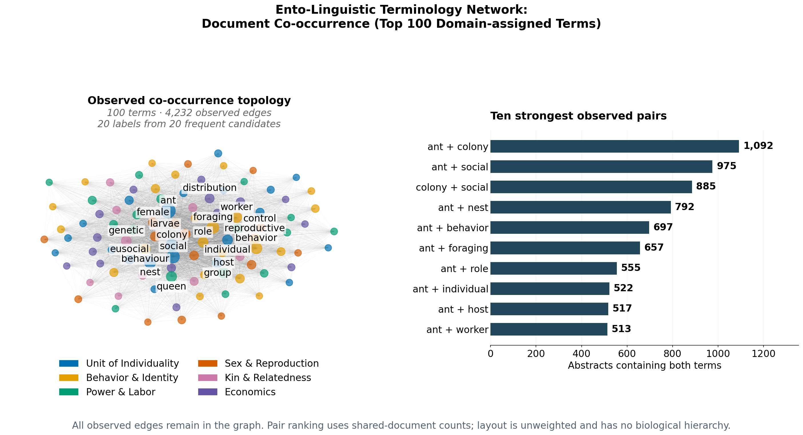

# Ento-Linguistics

**Language, ambiguity, and scientific communication in entomology.**

How do terms such as *queen*, *worker*, *caste*, and *colony* organize descriptions of ant biology? Ento-Linguistics provides a six-domain framework and a reproducible, descriptive analysis of scientific terminology across modern abstracts, full texts, historical OCR, and preprints.

[Read the paper](Ento_Linguistics_manuscript.pdf) · [Zenodo publication](https://zenodo.org/records/23215452) · [Documentation](docs/README.md) · [Reproduce the analyses](docs/guides/workflow.md)

Daniel Ari Friedman and Tucker Cahill Chambers

Published manuscript revision: **7 October 2026** · [Version DOI](https://doi.org/10.5281/zenodo.23215452) · [All versions](https://doi.org/10.5281/zenodo.19574117)

The working manuscript is **1.2.2-dev**, an unpublished revision. It strengthens biological definitions, measurement validation and the proposed reader-study design; reports the fixed-margin network comparison in the Results with injected values and its figure; and corrects figure presentation, citation style and the bibliography. [The local build](output/pdf/ento_linguistics_combined.pdf) is separate from the published paper above. Its analysis inputs and numerical results are unchanged.

## Network robustness and research lecture

The [fixed-margin network workflow](research/network_robustness/README.md) reconstructs the published abstract network and compares it with randomizations preserving document/term incidence margins. Both a primary protocol and a longer-burn/wider-spacing protocol have been executed. Their reports, traces, figures and independent receipts are under output/extensions/network_robustness/.

[The revised manuscript](Ento_Linguistics_manuscript.pdf) adds the fixed-margin method and strengthens interpretation and experimental design. Its renderer checks and, when needed, regenerates both companion protocols, including decoded-artifact validation. The original four-layer corpus analyses remain separately receipted; this extension does not claim to recompute them.

[Watch the 20-minute lecture](https://github.com/docxology/ento_linguistics/releases/download/v1.2.1/EntoLinguistics_20min_4K.mp4) · [Download slides](https://github.com/docxology/ento_linguistics/releases/download/v1.2.1/EntoLinguistics_slides.pdf) · [All release files](https://github.com/docxology/ento_linguistics/releases/tag/v1.2.1)

The 28-slide lecture uses Daniel Ari Friedman's DAF narration, timed bottom captions, six Manim animations, and original paper figures. It explains the published v1.1.1 baseline and the network extension now included in v1.2.0. Sources and production tools are maintained in LectureCreate; public media and research artifacts are archived with this release and on Zenodo.

## What this project studies

| Domain | Central question |
| --- | --- |
| Unit of Individuality | Which biological scale does a term identify: individual, nest, colony, or superorganism? |
| Behavior and Identity | When does a description of activity become a category of identity? |
| Power and Labor | What assumptions accompany terms such as caste, queen, and division of labor? |
| Sex and Reproduction | How are reproductive roles and developmental categories described? |
| Kin and Relatedness | How are genetic relatedness, kinship, and social interaction distinguished? |
| Economics | How are resource allocation, costs, investment, and exchange represented? |

The implemented analyses measure word frequencies, rule-based domain assignments, document co-occurrence, sentence-context entropy, and lexical framing patterns. CACE—Clarity, Appropriateness, Consistency, and Evolvability—is a heuristic scoring framework. These measurements support exploration; they do not establish causal effects of language or independently validated word senses.

## Explore the results

Edges in this terminology network count documents containing both terms among the hundred most frequent domain-assigned terms. The separate concept map connects six predefined categories by shared vocabulary. See [methods and interpretation](docs/reference/reproducibility.md) before interpreting either graph.

| Source layer | Published revision | Analysis boundary |
| --- | --- | --- |
| PubMed abstracts | 7,540 identified abstracts from 7,609 archived strings | 69 unreconciled strings retained but excluded from headline results |
| PMC | 7,073 records | Full-text analysis; deterministic discourse sample |
| BHL | 2,430 historical documents | All documents for literal counts, extraction, and framing; twenty entropy candidates per era |
| arXiv | 61 records | Separate preprint layer |

Full/default BHL processing covers **2,317,721,403 OCR characters**. Layers differ in genre, retrieval, language, and extraction threshold; their raw counts are not matched comparisons. Broad retrieval, OCR errors, repeated PMC bodies, overlapping domain groups, and incomplete relevance/license annotation remain documented limitations.

The published v1.2.1 paper contains **47 pages**. Its figures include the separately receipted network comparison. See the [data lineage](docs/reference/data-lineage.md) for the exports behind each result and the [verification reference](docs/reference/verification.md) for measured build evidence.

## Get started

Use **Python 3.10 or newer** and [uv](https://docs.astral.sh/uv/). Run commands from the repository root:

~~~bash
git clone https://github.com/docxology/ento_linguistics.git
cd ento_linguistics
uv sync --frozen --extra dev
uv run python -m nltk.downloader -d .venv/nltk_data stopwords punkt_tab wordnet omw-1.4
~~~

Read the existing paper without running analyses. To reproduce the stored corpus results:

~~~bash
uv run python scripts/02_generate_figures.py
PYTHONPATH=src uv run python -m pipeline.corpus_audit --require-analysis
~~~

The full corpus is large and BHL processing is memory intensive. [Setup](docs/guides/setup.md) explains resource selection and prerequisites; [workflow](docs/guides/workflow.md) explains caches, recovery checkpoints, and bounded development runs.

To render the paper, install Pandoc, XeLaTeX, and BibTeX, then run:

~~~bash
uv run python scripts/_render_pdf_override.py --strict-templates
~~~

The build writes [output/pdf/ento_linguistics_combined.pdf](output/pdf/ento_linguistics_combined.pdf). The top-level paper is the published copy; a new build does not automatically replace it or update Zenodo.

## Test and validate

~~~bash
uv run pytest tests/ --cov=src --cov-report=term-missing
~~~

Run tests and generation sequentially. The configured coverage floor is **90% combined statement/branch coverage**. The published v1.2.1 validation run recorded **1,802 passed, eight external-template skips, and 91.45% combined coverage**; these are captured results, not a claim that every later checkout has been rerun.

Content receipts bind actual corpus, source, dependency-lock, NLTK resource, and output bytes. The strict renderer rejects stale receipts and unresolved placeholders. [Validation](docs/guides/validation.md) explains numerical controls, custody checks, figure inspection, and PDF verification.

## Navigate the repository

| Directory | Contents |
| --- | --- |
| [src/](src/) | Text processing, analysis, provenance, pipelines, and visualization |
| [tests/](tests/) | Numerical, real-file, local-HTTP, corpus, and integration checks |
| [scripts/](scripts/README.md) | Corpus acquisition, generation, and rendering entry points |
| [data/](data/) | Stored source layers, provenance, and layer-specific analyses |
| [docs/](docs/README.md) | User guides, technical references, and manuscript source |
| [output/](output/) | Generated data, registered figures, custody report, and rendered paper |

## Develop and contribute

Start with the [development workflow](docs/guides/development.md). Reproduce a defect with real inputs, keep computation in source modules, and verify downstream statistics, figures, and manuscript variables after method changes. For prose, citations, and figures, use the [authoring guide](docs/guides/authoring.md).

Source identity and a successful build do not establish relevance, individual reuse rights, human agreement, or scientific validity. The [reproducibility reference](docs/reference/reproducibility.md) describes these boundaries.

## Cite the paper

Daniel Ari Friedman and Tucker Cahill Chambers. *Ento-Linguistics: Language, Ambiguity, and Scientific Communication in Entomology*. Manuscript revision, 7 October 2026. [doi:10.5281/zenodo.23215452](https://doi.org/10.5281/zenodo.23215452).

Use the version DOI to cite this PDF, or the [concept DOI](https://doi.org/10.5281/zenodo.19574117) to refer to the evolving work. The Zenodo paper is distributed under its recorded **CC BY 4.0** license. Corpus reuse remains subject to each source's terms; availability is not blanket redistribution permission.
