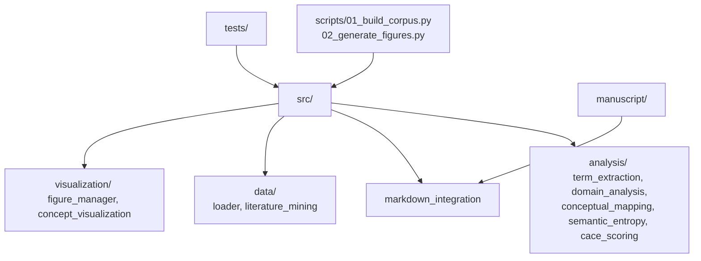

# src/ - Ento-Linguistic Analysis Code

## Purpose

This package contains **project-specific scientific code** implementing algorithms, data processing, analysis, and visualization for the Ento-Linguistic research project. Code is organized into five subdirectory packages.

## Directory Structure

```
src/
├── __init__.py
├── analysis/                   # Text analysis, NLP, domain analysis
│   ├── cace_scoring.py              # CACE scoring framework
│   ├── conceptual_mapping.py        # Concept mapping and network construction
│   ├── discourse_analysis.py        # Discourse pattern and rhetorical analysis
│   ├── discourse_patterns.py        # Discourse pattern detection
│   ├── domain_analysis.py           # Domain-specific analysis (six domains)
│   ├── performance.py               # Convergence and scalability analysis
│   ├── persuasive_analysis.py       # Persuasive technique analysis
│   ├── rhetorical_analysis.py       # Rhetorical structure analysis
│   ├── semantic_entropy.py          # Semantic entropy computation
│   ├── statistics.py                # Statistical analysis of language patterns
│   ├── term_extraction.py           # Terminology extraction and domain classification
│   └── text_analysis.py             # Text processing and linguistic feature extraction
├── core/                       # Core utilities, validation, metrics
│   ├── example.py                   # Template example with basic operations
│   ├── exceptions.py                # Custom exception classes
│   ├── logging.py                   # Logging utilities
│   ├── markdown_integration.py      # Markdown integration helpers
│   ├── metrics.py                   # Performance metrics and quality measures
│   ├── parameters.py                # Parameter set management and validation
│   ├── validation.py                # Result validation and quality assurance
│   └── validation_utils.py          # Validation utility functions
├── data/                       # Data loading, generation, literature mining
│   ├── data_generator.py            # Synthetic data generation
│   ├── data_processing.py           # Preprocessing, cleaning, normalization
│   ├── literature_mining.py         # Scientific literature collection (PubMed)
│   └── loader.py                    # Data loading utilities
├── pipeline/                   # Simulation and reporting
│   ├── reporting.py                 # Automated report generation
│   └── simulation.py               # Scientific simulation framework
└── visualization/              # Visualization and figure generation
    ├── concept_visualization.py     # Concept network and domain visualizations
    ├── figure_manager.py            # Figure registry and management
    ├── plots.py                     # Plot type implementations
    ├── statistical_visualization.py # Statistical analysis visualizations
    └── visualization.py             # Publication-quality figure generation
```

## Package Descriptions

### analysis/

The core NLP and domain analysis package. Key modules:

- **term_extraction.py** - Extracts domain-specific terminology from entomological texts with confidence scoring and domain classification
- **domain_analysis.py** - Analyzes terminology patterns within each of the six Ento-Linguistic domains (frequency distributions, co-occurrence, ambiguity metrics, cross-domain overlap)
- **conceptual_mapping.py** - Builds concept networks with similarity analysis, centrality metrics, cross-domain bridge identification, and hierarchical clustering
- **discourse_analysis.py** - Quantitative rhetorical pattern analysis, argumentative structure scoring, framing effect measurement
- **text_analysis.py** - Text processing and linguistic feature extraction
- **statistics.py** - Statistical analysis and hypothesis testing for language patterns
- **semantic_entropy.py** - Semantic entropy computation for measuring terminological uncertainty
- **cace_scoring.py** - CACE (Clarity, Appropriateness, Consistency, Evolvability) scoring and evaluation framework
- **performance.py** - Convergence and scalability analysis

### core/

Foundational utilities:

- **metrics.py** - Performance metrics (accuracy, precision/recall/F1, convergence, SNR, effect size)
- **parameters.py** - Parameter set management with validation and sweep generation
- **validation.py** - Result validation framework (bounds, sanity, reproducibility, anomaly detection)
- **validation_utils.py** - Validation helper functions
- **example.py** - Template example (add, multiply, average, min/max)
- **exceptions.py** - Custom exception hierarchy
- **logging.py** - Logging configuration
- **markdown_integration.py** - Markdown document helpers

### data/

Data handling and generation:

- **literature_mining.py** - Scientific literature collection from PubMed with caching and search result processing
- **data_processing.py** - Data preprocessing (cleaning, normalization, outlier detection, feature extraction)
- **data_generator.py** - Synthetic data generation for experiments
- **loader.py** - Data loading utilities

### pipeline/

Orchestration support:

- **reporting.py** - Automated report generation (markdown reports, summary tables, key findings extraction)
- **simulation.py** - Scientific simulation framework with reproducibility (checkpoint/restore, state tracking)

### visualization/

All figure generation:

- **concept_visualization.py** - Concept visualization (co-occurrence networks, domain overlap heatmaps, temporal evolution, 3D networks, statistical summaries)
- **statistical_visualization.py** - Statistical visualization (significance testing, correlation matrices, distribution comparison, effect sizes, confidence intervals, dashboards)
- **plots.py** - Standard plot types (line, scatter, bar, heatmap, contour, convergence, comparison)
- **visualization.py** - Publication-quality figure engine (multi-panel figures, styling)
- **figure_manager.py** - Figure registry and cross-reference management

## Import Patterns

Modules are imported via their package path:

```python
from analysis.term_extraction import TerminologyExtractor
from analysis.domain_analysis import DomainAnalyzer
from core.metrics import calculate_accuracy
from data.literature_mining import LiteratureCorpus
from visualization.concept_visualization import ConceptVisualizer
```

## Example Signatures

```python
from src.analysis.term_extraction import TerminologyExtractor, Term, create_domain_seed_expansion
from src.core.validation import ValidationFramework, ValidationResult
from src.data.loader import DataLoader

extractor = TerminologyExtractor()
terms: dict[str, Term] = extractor.extract_terms(texts, min_frequency=2)
term: Term = terms["eusocial"]
term.add_context("..."); data = term.to_dict()

framework = ValidationFramework()
result: ValidationResult = framework.validate_bounds(
    np.array([0.1, 0.5, 0.9]), "confidence", min_value=0.0, max_value=1.0
)

loader = DataLoader()
corpus = loader.load_corpus("corpus/abstracts.json")
```

## Module Dependencies



## Requirements

Run `uv run pytest tests/ --cov=src --cov-report=term-missing` for current status (1199 tests, ~91% coverage per output/reports/test_results.json).

- Type hints on public APIs
- Docstrings
- Real data and httpserver testing (no mocks)
- Fixed seeds for reproducibility

## See Also

- [`../scripts/AGENTS.md`](../scripts/AGENTS.md) - Script orchestrators
- [`../tests/AGENTS.md`](../tests/AGENTS.md) - Test mappings
- [`../AGENTS.md`](../AGENTS.md) - Project documentation
